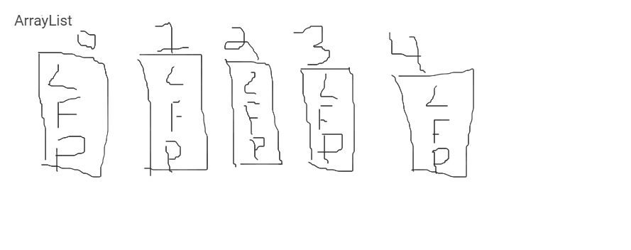

# Phonebook
Benson, Daiana, Eric Liu, Victoria

## ArrayList

### Phonebook class

- ArrayList of public class *person*
- Instance Variable in Phonebook:
    - ArrayList<Person> people = new ArrayList<Person>()
    - 

- add:
  - input: String firstName, lastName, int phoneNumber
  - runtime: linear O(n), binary O(log n)
  - inputs/parameters: Person object
  - return type: void
  - binary - use compareTo() to find two indices where one is more than the last name and one that is less than the last name
- find:
  - inputs/parameters: String lastName
  - return type: Person if found, otherwise null
  - runtime: linear O(n), extension try binary search O(log n)
  - compareTo() method to compare strings
    - binary search compare the elements in arraylist with the lastName 
    - ```java
    int compareTo(String anotherString) {  
    int length1 = value.length;  
    int length2 = anotherString.value.length;  
    int limit = Math.min(length1, length2);  
    char v1[] = value;  
    char v2[] = anotherString.value;  
    int i = 0;  
    while (i < limit) {  
        char ch1 = v1[i];  
        char ch2 = v2[i];  
        if (ch1 != ch2) {  
            return ch1 - ch2;  
        }  
        i++;  
    }  
    return length1 - length2;     
    }
- remove:
  - Use find(), remove if in ArrayList
  - runtime: linear O(n), binary (log n)
- printList:
  - runtime: O(n)
  - inputs: none
  - return type: void (will print)
  - for loop to traverse through each element in arraylist and print each element